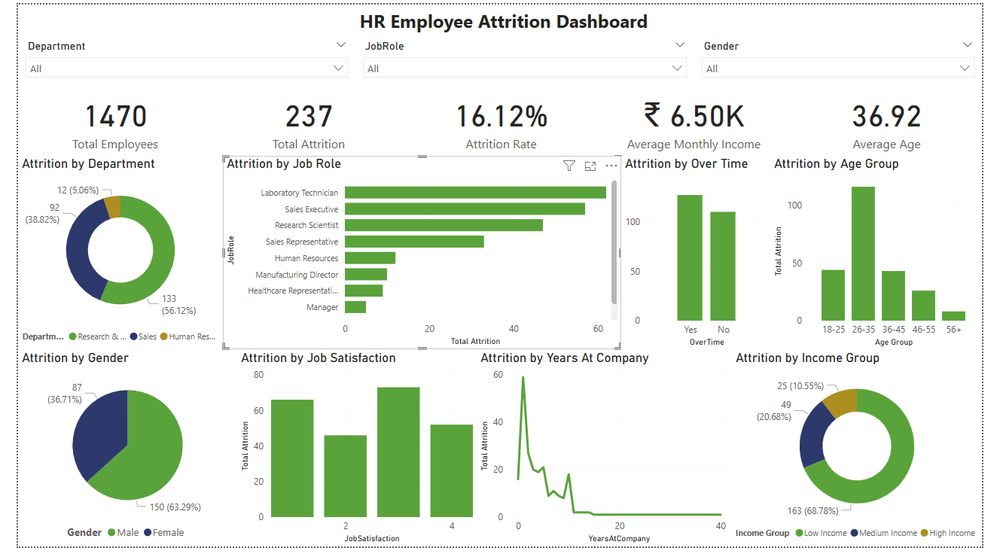

# HR Employee Attrition Analysis

## Project Overview
This project analyzes employee attrition data to identify patterns and factors associated with employee turnover.

The analysis was performed using SQL for data exploration and Power BI for creating an interactive dashboard.

## Tools Used
- MySQL
- Power BI
- Excel
- DAX

## Dataset
The dataset contains 1,470 employee records with information related to:
- Employee demographics
- Department and Job Role
- Monthly Income
- Job Satisfaction
- Overtime
- Years at Company
- Employee Attrition

## SQL Analysis
SQL was used to analyze the HR dataset and answer business questions related to:

- Overall employee attrition
- Department-wise attrition
- Job Role analysis
- Monthly Income analysis
- Overtime and attrition
- Job Satisfaction
- Employee tenure
- Income categories
- Subqueries and CTEs
- Window Functions
- Joins

## Power BI Dashboard

The interactive Power BI dashboard includes:

### KPI Cards
- Total Employees
- Total Attrition
- Attrition Rate
- Average Monthly Income
- Average Age

### Visualizations
- Attrition by Department
- Attrition by Job Role
- Attrition by Overtime
- Attrition by Age Group
- Attrition by Gender
- Attrition by Job Satisfaction
- Attrition by Years at Company
- Attrition by Income Group

### Interactive Filters
- Department
- Job Role
- Gender

## Key Insights

- Research & Development recorded the highest number of employee attritions.
- Male employees accounted for a higher number of attritions than female employees.
- Employees working overtime showed a high number of attritions.
- Employees aged 26–35 recorded the highest attrition.
- The low-income employee group recorded the highest attrition, suggesting that compensation could be one of the factors associated with employee turnover.
- Attrition was concentrated more heavily among employees with shorter tenure at the company.

## Dashboard

## Conclusion

The analysis highlights employee groups where attrition is concentrated and provides an interactive dashboard to explore attrition patterns across departments, job roles, income levels, age groups, and other employee characteristics.
